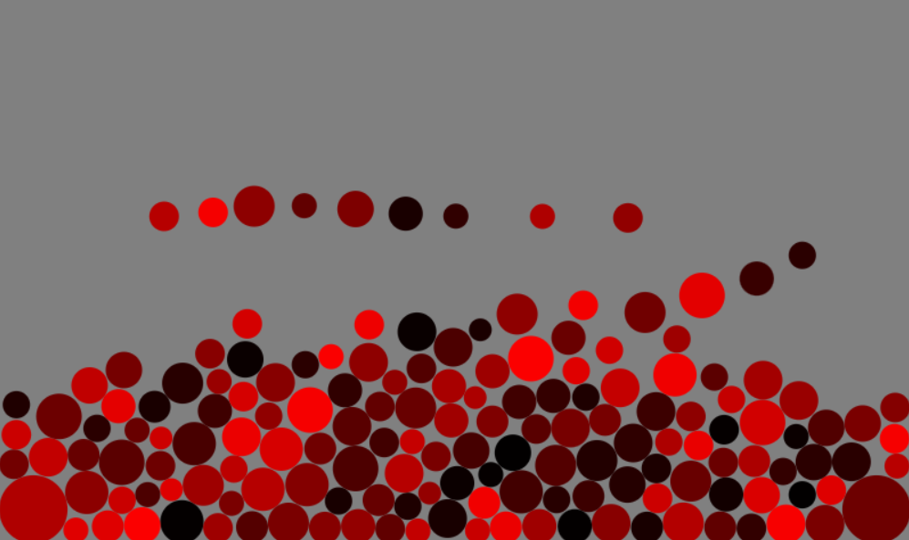

# 2D Physics Demo

A simple **Verlet Physics Simulation** demo implemented in JavaScript.

## ✨ Features
- **Energy Conservation:** The demo conserves energy throughout the simulation.
- **Gravity Simulation:**
  - Particle-particle gravitational interactions.
  - Standard gravity along the x and y axes.
- **Event-Driven Mechanics:** 
  - Optimized to handle interactions dynamically, reducing unnecessary computations.

  ## 🚀 How to Run
1. Clone the repository.

2. Open index.html in your browser to see the simulation in action. Click anywhere on the screen to add new balls.

3. Customize the JavaScript code to explore different scenarios or behaviors.